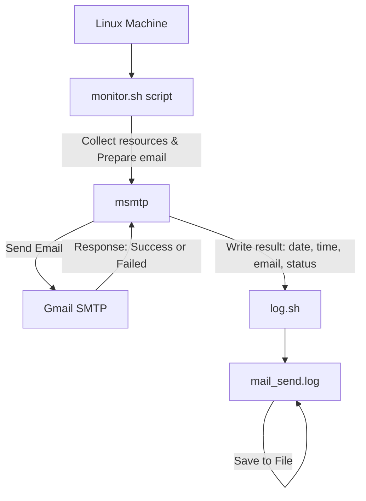

# 1. Introduction
## 1.1. Project overview
The DevOps Intern project aims to automate operational processes, send emails, collect resource metrics, enable containerization, and configure logging and security.
The main objective is to enable the team to apply their Linux, scripting, Docker, security, and email-sending skills in a real-world scenario.
## 1.2. Scope of works
* Timeline: 06/10/2025
* Environment: 
* Main Technologies:
## 1.3. Team members
* Intern: Loc Phan
* Mentor: Khoi Nguyen
* Reviewer: Khoi Nguyen
# 2. Requirement
## 2.1. Requirement description
* "Automatically deploy application to staging environment whenever there's new code on develop branch"
* "Automatically build Docker image and push to Docker Hub when merging to main branch"
* "Monitor backend application errors and send alerts via Slack"
## 2.2. Technical requirements
- Environment:
    - OS: [Ubuntu 24.04.02]
    - Containerization: [Docker]
- Security:
- Logging & Monitoring:
- Reliability:
# 3. Solution Architecture
## 3.1. Solution Overview
## 3.2. Main Components
## 3.3. Execution Workflow

# 4. Implementation Guide
## 4.1. Related Files/Scripts
- Repository Structure:
``` project-root/
├──scripts/
│    ├──log.sh
│    ├──mail_send.log
│    ├──monitor.sh
│
```
## 4.2. Initial Setup
- Prerequisites:
Install and set up Oracle VM
Configuration Steps:

```    #Setup for send email
    sudo apt update
    sudo apt install msmtp mailutills
```
```
    #Configure msmtp
    defaults
    auth on
    tls on
    tls_trust_file /etc/ssl/certs/ca-certificates.crt
    logfile ~/.msmtp.log
    account gmail
    host smtp.gmail.com
    port 587
    from pptloc28@gmail.com
    user pptloc28@gmail.com
    password app password
    account default : gmail

    #Set permissions:
    chmod 600 ~/.msmtprc 
```

## 4.3 Configuration Variables
# 5. Appendix
## 5.1. Tool Used
* Docker

* msmtp

* Bash script

* Cron
## 5.2. References
- [Docker Official Docs](https://docs.docker.com/)  
- [msmtp Official Docs](https://msmtp.gitforge.net/doc/msmtp.html)