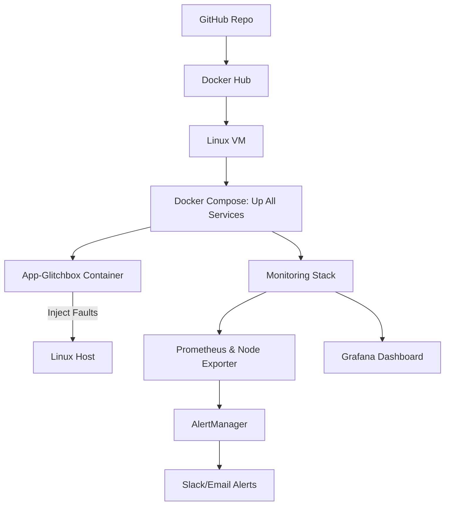

# 1. Introduction
## 1.1. Project overview
The DevOps Intern project aims to automate operational processes, send emails, collect resource metrics, enable containerization, and configure logging and security.
The main objective is to enable the team to apply their Linux, scripting, Docker, security, and email-sending skills in a real-world scenario.
## 1.2. Scope of works
* Timeline: 06/10/2025
* Environment: 
* Main Technologies:
## 1.3. Team members
* Intern: Loc Phan
* Mentor: Khoi Nguyen
* Reviewer: Khoi Nguyen
Timeline: 06/10/2025
# 2. Requirement
## 2.1. Requirement description
  App-Glitchbox Description
  App-Glitchbox is a chaos engineering application that simulates various system failures and issues. It uses ChaosBlade to create controlled chaos in the system, helping to test system resilience and monitoring capabilities.
  Core features:
* Random CPU load spikes (90% for 60s)
* Memory pressure simulation (80% for 60s)
* Application crashes
* Network latency injection (3000ms)
* Disk space filling (512MB)
* Application hangs (10 minutes)
## 2.2. Technical requirement
* Linux VM (Ubuntu 22.04 LTS recommended)
* Docker Engine
* Docker Compose
* Git
* Docker Hub account for image registry
* Minimum 2GB RAM
* 20GB free disk space
# 3. Solution Architecture
## 3.1. Solution Overview

## 3.2. Main Components
### 1. App-Glitchbox
* The main application container
* Based on Ubuntu 22.04, with ChaosBlade installed
* Purpose: executes chaos experiments such as CPU spikes, memory pressure, crashes, etc.
### 2. Prometheus
* Time-series monitoring and metrics collection system
* Uses a pull model to scrape data from Node Exporter and the application
### 3. Node Exporter
* Exposes host-level system metrics (CPU, RAM, disk, network)
* Prometheus scrapes this data periodically
### 4. Alertmanager
* Handles alerts generated by Prometheus
* Responsible for routing notifications via email, discord
### 5. Grafana
* Visualization tool for metrics and dashboards
* Displays real-time data and can trigger alert notifications
## 3.3. Execution Workflow
### 1.System startup
* App-Glitchbox
* Prometheus
* Node Exporter
* Grafana
* Alertmanager
### 2.App-Glitchbox execution
* App-Glitchbox runs an entrypoint script which triggers fault injection using ChaosBlade 
### 3.Metrics exposure
* Node Exporter exposes host-level metrics (CPU, memory, disk, etc.)
### 4.Prometheus scraping
* Prometheus periodically scrapes metrics from:
    * Node Exporter (system-level data)
* It compares real-time metrics against predefined alert rules
### 5.Alert evaluation
* When a threshold is breached (e.g., CPU > 90%), Prometheus triggers an alert
* Prometheus sends the alert to Alertmanager
### 6.Alert routing
* Alertmanager receives the alert and checks the routing configuration
* Depending on the severity and alert label, it sends notifications to:
    * Email
    * Discord
### 7. Data visualization
* Grafana connects to Prometheus as its data source
* Dashboards display system and container metrics in real-time
* Alerts and system behavior under chaos conditions can be monitored visually
# 4. Implementation guide
## 4.1 Related Files/Scripts
* Repository Structure:
``` project-root/
├──scripts/
│    ├──alert.rules.yml
│    ├──alertmanager.yml
│    ├──docker-compose.yml
│    ├──Dockerfile
│    ├──entrypoint.sh
│    ├──metric_server.py
│    ├──prometheus.yml
│
```