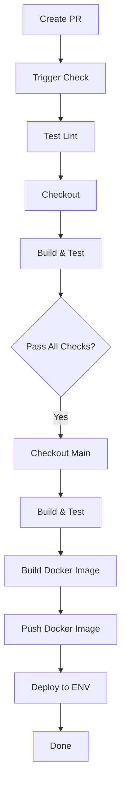

# 1. Introduction
## 1.1. Project overview
The DevOps Internship CI/CD project aims to implement a continuous integration and deployment pipeline for a simple ASP.NET application. This project leverages GitHub Actions, Docker, and Azure Virtual Machines to automate the testing, building, and deployment process. The objective is to apply DevOps best practices to streamline software delivery while ensuring reproducibility, reliability, and maintainability.
## 1.2. Scope of works
* Timeline: 06/10/2025
* Environment: GitHub, Docker Hub, Azure VM (Ubuntu 22.04)
* Main Technologies: GitHub Actions, Docker, .NET SDK, Azure SSH
## 1.3. Team members
* Intern: Loc Phan
* Mentor: Khoi Nguyen
* Reviewer: Khoi Nguyen
# 2. Requirement
## 2.1. Requirement description
* Automatically lint PR titles to enforce naming conventions
* Build and test ASP.NET app in CI stage
* Tag version and push Docker image to Docker Hub in CD stage
* SSH into Azure VM and deploy container in CD stage
## 2.2. Technical requirement
* GitHub public repository for the source code
* Docker Hub account for container registry
* Azure VM with Docker installed
* Dockerfile for the ASP.NET app
* GitHub secrets for credentials and VM access
# 3. Solution Architecture
## 3.1. Solution Overview

## 3.2. Main Components
### 1. GitHub Actions
* CI/CD automation tool native to GitHub
* Triggers on pull requests and tag creation
* Executes jobs such as lint check, build, test, and deployment
### 2. ASP.NET App
* Sample web application built on .NET SDK
* Includes unit tests for CI validation
* Dockerized using a custom Dockerfile
### 3. Docker Hub
* Public image registry
* Stores versioned container images built in the CD stage
* Images tagged using semantic versioning (e.g., v1.0.0-d, v1.0.0-s)
### 4. Azure Virtual Machine
* Target deployment host for the final container
* Runs Ubuntu 22.04 with Docker installed
* Accessible via SSH using GitHub Secrets 
## 3.3. Execution Workflow
### 1. Pull Request Created
* Developer pushes a new feature/fix branch
* Opens a pull request against main
* GitHub Actions triggers CI & PR Lint workflow
### 2. CI & PR Lint Workflow
* Job 1: Lint PR title using regex to enforce naming standards (e.g., feat/, fix/, chore/, etc.)
* Job 2: Checkout code, build the ASP.NET project, and run tests
* If both jobs succeed, PR is eligible for merge (protected by branch rules)
### 3. Post-Merge CI Stage
* On merge to main, a second build and test phase is triggered to verify integrity
### 4. Tag-based CD Stage
* Developer pushes a tag following format vX.Y.Z-d or vX.Y.Z-s
* CD workflow triggers:
  * Build Docker image from Dockerfile
  * Push image to Docker Hub with matching tag
  * SSH into Azure VM
  * Pull the image and restart the container 
### 5. Deployment Confirmation
* After successful SSH deployment:
  * Application runs on a predefined port (e.g., 8080)
  * Manual or automated validation can be conducted
# 4. Implementation Guide
## 4.1. Repository Structure
```
project-root/
├── .github/
│   └── workflows/
│       ├── ci.yml
│       └── cd.yml
├── aspnetapp/
│   └── Program.cs (and other app files)
├── Dockerfile
├── .dockerignore
├── README.md
```
## 4.2. GitHub Actions Configuration
### 1. CI Workflow (ci.yml)
* Trigger: pull_request to main
* Jobs:
  * pr-lint: Validates PR title format
  * build-test: Restores dependencies, builds project, runs tests
### 2. CD Workflow (cd.yml)
* Trigger: push tag matching v*.*.*-*
* Jobs:
 * build-push: Builds Docker image and pushes to Docker Hub
 * deploy: SSH into VM, pulls image, stops old container, runs new one
### 3. GitHub Secrets
| Secret Name       | Purpose                            |
| ----------------- | ---------------------------------- |
| `DOCKER_USERNAME` | Docker Hub login                   |
| `DOCKER_PASSWORD` | Docker Hub password or token       |
| `AZURE_SSH_HOST`  | Public IP of Azure VM              |
| `AZURE_SSH_USER`  | Username for SSH login             |
| `AZURE_SSH_KEY`   | Private key for SSH authentication |
### 4. Azure VM Setup
* Provision VM on Azure with Ubuntu 22.04
* Install Docker:
* Create user SSH key and register with GitHub Secrets
# 5. Appendix
| Tool           | Version      | Purpose          | Documentation                                                                                                          |
| -------------- | ------------ | ---------------- | ---------------------------------------------------------------------------------------------------------------------- |
| GitHub Actions | Latest       | CI/CD Pipeline   | [https://docs.github.com/en/actions](https://docs.github.com/en/actions)                                               |
| Docker         | Latest       | Containerization | [https://docs.docker.com](https://docs.docker.com)                                                                     |
| .NET SDK       | 8.0          | App Development  | [https://learn.microsoft.com/en-us/dotnet/](https://learn.microsoft.com/en-us/dotnet/)                                 |
| Azure VM       | Ubuntu 22.04 | Deployment Host  | [https://learn.microsoft.com/en-us/azure/virtual-machines/](https://learn.microsoft.com/en-us/azure/virtual-machines/) |
| Docker Hub     | Public       | Image Registry   | [https://hub.docker.com](https://hub.docker.com)                                                                       |


