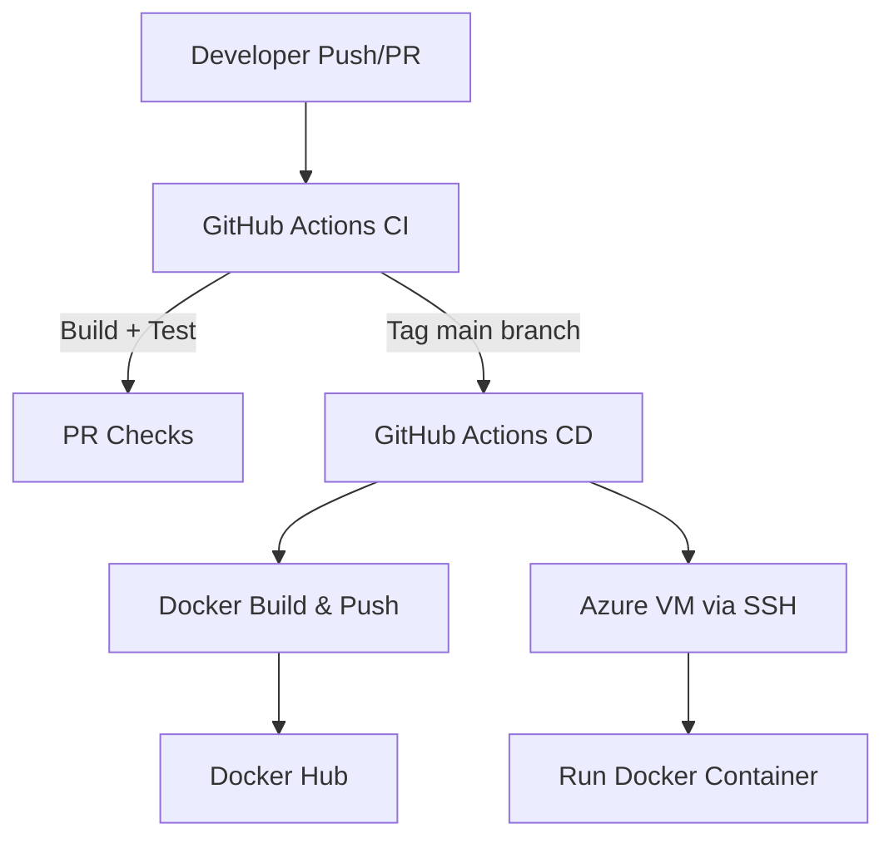

# 1. Introduction
## 1.1. Project overview
The DevOps Internship CI/CD project aims to implement a continuous integration and deployment pipeline for a simple ASP.NET application. This project leverages GitHub Actions, Docker, and Azure Virtual Machines to automate the testing, building, and deployment process. The objective is to apply DevOps best practices to streamline software delivery while ensuring reproducibility, reliability, and maintainability.
## 1.2. Scope of works
* Timeline: 06/10/2025
* Environment: GitHub, Docker Hub, Azure VM (Ubuntu 22.04)
* Main Technologies: GitHub Actions, Docker, .NET SDK, Azure SSH
## 1.3. Team members
* Intern: Loc Phan
* Mentor: Khoi Nguyen
* Reviewer: Khoi Nguyen
# 2. Requirement
## 2.1. Requirement description
* Automatically lint PR titles to enforce naming conventions
* Build and test ASP.NET app in CI stage
* Tag version and push Docker image to Docker Hub in CD stage
* SSH into Azure VM and deploy container in CD stage
## 2.2. Technical requirement
* GitHub public repository for the source code
* Docker Hub account for container registry
* Azure VM with Docker installed
* Dockerfile for the ASP.NET app
* GitHub secrets for credentials and VM access
# 3. Solution Architecture
## 3.1. Solution Overview

